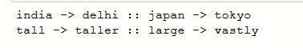
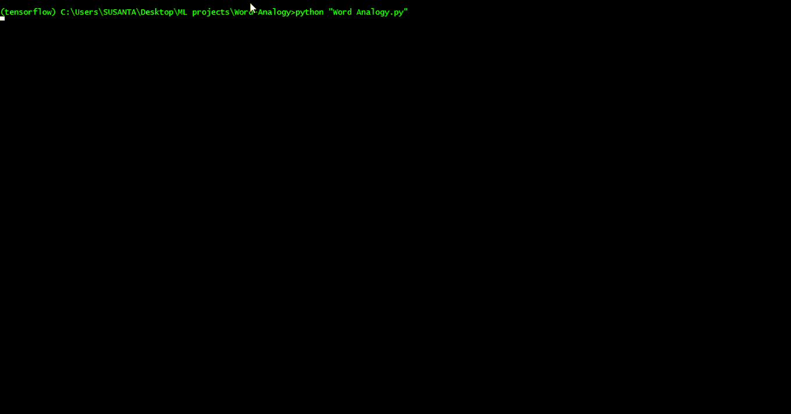

# Word-Analogy

# <u>Word Analogy using Word Embeddings 
Finding word analogies using **GLoVe** word embeddings. 
In the word analogy task, we have **"a is to b as c is to __"**. For example is 'boy is to girl as king is to queen' .

Example word analogy 

Output word analogy for user input  

We find a word **d**, such that the associated word vectors **e_a, e_b, e_c, e_d** are related in the following manner:  
**e_b - e_a ~ e_d - e_c**.  
For finding **d** we measure the similarity between **e_b - e_a** and **e_d - e_c** using **cosine** similarity.  

There are two versions available:
1. Jupyter notebook
2. Python script

Here is a demo of Python script

### Credits
1. This project is based on the assignment from Sequence Models Specialization by Deeplearning.ai on Coursera.
https://www.coursera.org/learn/nlp-sequence-models/home/welcome.
2. Jeffrey Pennington, Richard Socher, and Christopher D. Manning. 2014. GloVe: Global Vectors for Word Representation. [pdf](https://nlp.stanford.edu/pubs/glove.pdf) [bib](https://nlp.stanford.edu/pubs/glove.bib)
